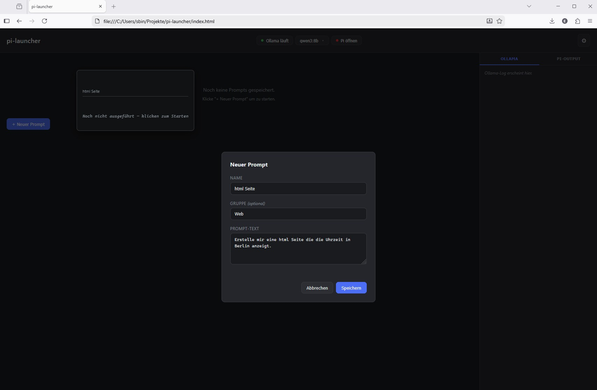
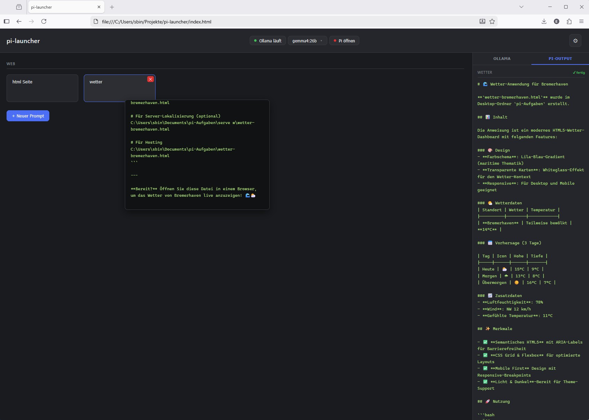

# Pi Coding Agent — Windows 11 Setup

Schritt-für-Schritt Anleitung zum Einrichten des [Pi Coding Agent](https://pi.dev/) auf Windows 11 mit lokalem Ollama-Modell.

> 📺 Einführungsvideo (https://www.youtube.com/watch?v=MwOgfB4E8HE&t=6s)

---

## Voraussetzungen

- Windows 11
- [Node.js LTS](https://nodejs.org/) (v22 empfohlen) installiert
- [Ollama](https://ollama.com/) installiert und lauffähig
- RTX 3060 Ti oder vergleichbar (8 GB VRAM) — oder mehr

---

## 1. Modell herunterladen

```powershell
ollama pull qwen3.5
```

`qwen3.5` (6,6 GB, 256K Kontext) ist das empfohlene Modell für 8 GB VRAM.  
Ollama läuft danach als Dienst im Hintergrund auf Port `11434`.

---

## 2. Pi installieren

```powershell
npm install -g @mariozechner/pi-coding-agent
```

---

## 3. Konfiguration

Ordner anlegen:

```powershell
mkdir $env:USERPROFILE\.pi\agent
```

### `models.json`

Datei: `C:\Users\<username>\.pi\agent\models.json`

```json
{
  "providers": {
    "ollama": {
      "baseUrl": "http://localhost:11434/v1",
      "api": "openai-completions",
      "apiKey": "ollama",
      "models": [
        { "id": "qwen3.5" }
      ]
    }
  }
}
```

> Der `apiKey`-Wert wird von Ollama ignoriert — irgendein String reicht.

### `settings.json`

Datei: `C:\Users\<username>\.pi\agent\settings.json`

```json
{
  "defaultProvider": "ollama",
  "defaultModel": "qwen3.5"
}
```

---

## 4. Pi starten

Immer aus dem Projektordner starten — pi arbeitet im aktuellen Verzeichnis:

```powershell
cd C:\Users\<username>\Projekte\MeinProjekt
pi
```

---

## 5. Update

```powershell
npm update -g @mariozechner/pi-coding-agent
```

---

## Packages

Packages erweitern pi um zusätzliche Funktionen. Installation innerhalb von pi:

```
pi install npm:<packagename>
```

Nach der Installation pi neu starten — Packages werden nur beim Start geladen.

### pi-mermaid

Rendert Mermaid-Diagramme direkt als ASCII im Terminal.

```
pi install npm:pi-mermaid
```

→ [npmjs.com/package/pi-mermaid](https://www.npmjs.com/package/pi-mermaid)

### pi-web-access

Web-Suche und URL-Inhalte abrufen. Unterstützt GitHub-Repos klonen, PDFs extrahieren und URL-Fetch mit Fallback-Ketten.

```
pi install npm:pi-web-access
```

Konfigurationsdatei: `C:\Users\<username>\.pi\web-search.json`

```json
{
  "workflow": "none"
}
```

> `workflow: none` deaktiviert den interaktiven Review-Dialog bei jeder Suche.  
> Für API-Keys (Exa, Perplexity, Gemini) siehe [Dokumentation](https://www.npmjs.com/package/pi-web-access).  
> ⚠️ Chromium-Cookie-Extraktion funktioniert nur auf macOS/Linux — auf Windows fallen Gemini-Fallbacks weg.

→ [npmjs.com/package/pi-web-access](https://www.npmjs.com/package/pi-web-access)

### pi-free-web-search

Kostenlose Websuche ohne API-Key über DuckDuckGo, Yahoo oder Brave.

```
pi install npm:pi-free-web-search
```

Konfigurationsdatei: `C:\Users\<username>\.pi\free-web-search.json`

```json
{
  "preferredEngine": "duckduckgo"
}
```

> DuckDuckGo-Scraping ist kein offizielles API — gelegentliche CAPTCHA-Blokaden möglich.

---

## Weitere Packages

→ [pi.dev/packages](https://pi.dev/packages)

> ⚠️ **Sicherheitshinweis:** Pi-Packages laufen mit vollem Systemzugriff. Extensions führen beliebigen Code aus. Quellcode vor der Installation prüfen.

---

## Konfigurationsdateien — Übersicht

| Datei | Zweck |
|-------|-------|
| `%USERPROFILE%\.pi\agent\models.json` | Provider und Modelle definieren |
| `%USERPROFILE%\.pi\agent\settings.json` | Default-Provider und Default-Modell |
| `%USERPROFILE%\.pi\web-search.json` | Konfiguration für `pi-web-access` |
| `%USERPROFILE%\.pi\free-web-search.json` | Konfiguration für `pi-free-web-search` |

---

## Nützliche pi-Befehle

| Befehl | Funktion |
|--------|----------|
| `pi` | Pi starten (im aktuellen Verzeichnis) |
| `pi -c` | Letzte Session fortsetzen |
| `pi -r` | Session aus Liste auswählen |
| `/model` oder `Ctrl+L` | Modell wechseln |
| `/tree` | Session-Baum navigieren, zu früherem Punkt zurück |
| `/hotkeys` | Alle Tastenkürzel anzeigen |
| `Ctrl+O` | Startup-Info und geladene Ressourcen anzeigen |
| `Ctrl+C` | Pi beenden |

---

## pi-launcher — Browser-GUI

Eine lokale Web-GUI zum Starten von Pi-Prompts, Verwalten von Ollama und Wechseln des Modells — alles im Browser, ohne zusätzliche Abhängigkeiten.

Die Dateien liegen im Ordner [`pi-launcher/`](./pi-launcher/).



### Voraussetzungen

- Python 3.7 oder neuer (nur Standardbibliothek, keine Pip-Pakete nötig)
- Ollama ist installiert und lokal erreichbar (Port `11434`)
- Pi ist installiert (`npm install -g @mariozechner/pi-coding-agent`)

### Starten

```powershell
cd pi-launcher
python server.py
```

Danach `pi-launcher\index.html` direkt im Browser öffnen (Doppelklick oder per `file:///...`-Adresse). Der Server muss im Hintergrund laufen.

### Aufbau der Oberfläche

**Topbar**

| Element | Funktion |
|---------|----------|
| `● Ollama läuft` / `● Ollama starten` | Statusanzeige. Klick startet `ollama serve` und zeigt den Output live im Ollama-Tab der Sidebar. Grün = läuft, Rot = gestoppt, Gelb = startet. |
| Modell-Dropdown (`qwen3.5 ▾`) | Zeigt alle lokal installierten Ollama-Modelle mit Dateigröße. Auswahl schreibt sofort in `~/.pi/agent/settings.json`. Nur sichtbar wenn Ollama läuft. |
| `● Pi öffnen` | Öffnet ein neues CMD-Fenster mit `pi` im konfigurierten Arbeitsverzeichnis. Grüner Punkt solange das Fenster offen ist. |
| `⚙` | Einstellungen: Arbeitsverzeichnis ändern (Standard: `~/Desktop/pi-aufgaben`). |

**Prompt-Buttons**

- Gespeicherte Prompts erscheinen als Kacheln im Grid.
- **Klick** startet `pi -p "<prompt>"` im Arbeitsverzeichnis — Output erscheint live im Tab „Pi-Output" der Sidebar.
- **Hover** zeigt den letzten Output des Prompts als Tooltip.
- `✕`-Symbol beim Hovern löscht den Prompt.
- Laufende Prompts zeigen einen animierten grünen Punkt.
- **„+ Neuer Prompt"**: Name und Prompt-Text eingeben, im `localStorage` gespeichert.

**Sidebar (rechts)**

| Tab | Inhalt |
|-----|--------|
| Ollama | Live-Output von `ollama serve` beim Start |
| Pi-Output | Live-Output des zuletzt gestarteten Prompts mit Status (● läuft / ✓ fertig) |



### Konfiguration

| Datei | Inhalt |
|-------|--------|
| `pi-launcher\config.json` | Arbeitsverzeichnis (wird vom Server geschrieben) |
| `%USERPROFILE%\.pi\agent\settings.json` | Aktives Modell (wird vom Modell-Dropdown geschrieben) |

### Technische Details

- `server.py` läuft auf `http://localhost:8765` — Python-Standardbibliothek, keine Pip-Abhängigkeiten
- Prompts und Ollama-Start werden per **Server-Sent Events (SSE)** live gestreamt
- `index.html` ist eine einzelne Datei mit inline CSS/JS — kein CDN, kein Framework
- CORS-Header ermöglichen den direkten Aufruf als `file://` im Browser

---

## Referenzen

- [pi.dev](https://pi.dev/) — Offizielle Website
- [GitHub: badlogic/pi-mono](https://github.com/badlogic/pi-mono) — Quellcode
- [npmjs: @mariozechner/pi-coding-agent](https://www.npmjs.com/package/@mariozechner/pi-coding-agent)
- [Ollama](https://ollama.com/) — Lokale Modelle
- [pi.dev/packages](https://pi.dev/packages) — Package-Verzeichnis
